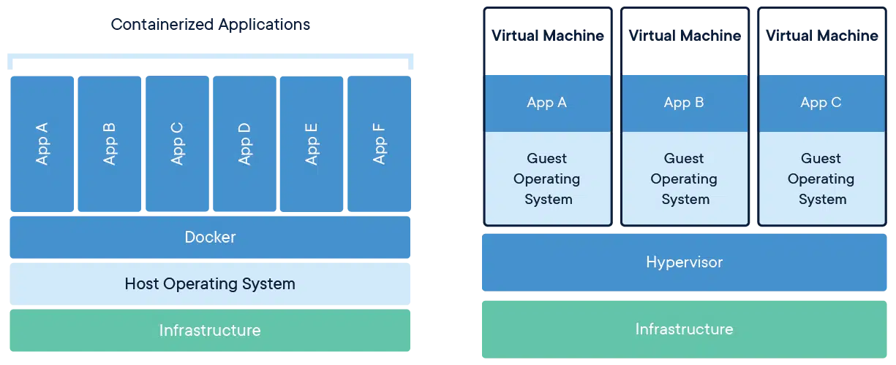

# What is the difference between a container and a virtual machine?

You may have heard of Linux containers, which are conceptually similar to virtual machines, but function somewhat differently. While both containers and virtual machines allow for running applications in an isolated environment, allowing you to stack many onto the same machine as if they are separate computers, containers are not full, independent machines. A container is actually just an isolated process that shared the same Linux kernel as the host operating system, as well as the libraries and other files needed for the execution of the program running inside of the container, often with a network interface such that the container can be exposed to the world in the same way as a virtual machine. Typically, containers are designed to run a single program, as opposed to emulating a full multi-purpose server.

(convsvm1.jpg)

# Containers and Virtual Machines Together

Containers and VMs used together provide a great deal of flexibility in deploying and managing app

