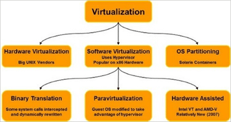

# What is virtualization?

Virtualization is the process of running a virtual instance of a computer system in a layer abstracted from the actual hardware. Most commonly, it refers to running multiple operating systems on a computer system simultaneously. To the applications running on top of the virtualized machine, it can appear as if they are on their own dedicated machine, where the operating system, libraries, and other programs are unique to the guest virtualized system and unconnected to the host operating system which sits below it.

There are many reasons why people utilize virtualization in computing. To desktop users, the most common use is to be able to run applications meant for a different operating system without having to switch computers or reboot into a different system. For administrators of servers, virtualization also offers the ability to run different operating systems, but perhaps, more importantly, it offers a way to segment a large system into many smaller parts, allowing the server to be used more efficiently by a number of different users or applications with different needs. It also allows for isolation, keeping programs running inside of a virtual machine safe from the processes taking place in another virtual machine on the same host.

### What are 5 types of virtualization?

All the components of a traditional data center or IT infrastructure can be virtualized today, with various specific types of virtualization:   

- Hardware virtualization: When virtualizing hardware, virtual versions of computers and operating systems (VMs) are created and consolidated into a single, primary, physical server. A hypervisor communicates directly with a physical server’s disk space and CPU to manage the VMs. Hardware virtualization, which is also known as server virtualization, allows hardware resources to be utilized more efficiently and for one machine to simultaneously run different operating systems. 

- Software virtualization: Software virtualization creates a computer system complete with hardware that allows one or more guest operating systems to run on a physical host machine. For example, Android OS can run on a host machine that is natively using a Microsoft Windows OS, utilizing the same hardware as the host machine does. Additionally, applications can be virtualized and delivered from a server to an end user’s device, such as a laptop or smartphone. This allows employees to access centrally hosted applications when working remotely. 

- Storage virtualization: Storage can be virtualized by consolidating multiple physical storage devices to appear as a single storage device. Benefits include increased performance and speed, load balancing and reduced costs. Storage virtualization also helps with disaster recovery planning, as virtual storage data can be duplicated and quickly transferred to another location, reducing downtime.  

- Network virtualization: Multiple sub-networks can be created on the same physical network by combining equipment into a single, software-based virtual network resource. Network virtualization also divides available bandwidth into multiple, independent channels, each of which can be assigned to servers and devices in real time. Advantages include increased reliability, network speed, security and better monitoring of data usage. Network virtualization can be a good choice for companies with a high volume of users who need access at all times. 

- Desktop virtualization: This common type of virtualization separates the desktop environment from the physical device and stores a desktop on a remote server, allowing users to access their desktops from anywhere on any device. In addition to easy accessibility, benefits of virtual desktops include better data security, cost savings on software licenses and updates, and ease of management. 

# What is a virtual machine?

[VM.md](VM.md)

# What is the difference between a container and a virtual machine?

You may have heard of Linux containers, which are conceptually similar to virtual machines, but function somewhat differently. While both containers and virtual machines allow for running applications in an isolated environment, allowing you to stack many onto the same machine as if they are separate computers, containers are not full, independent machines. A container is actually just an isolated process that shared the same Linux kernel as the host operating system, as well as the libraries and other files needed for the execution of the program running inside of the container, often with a network interface such that the container can be exposed to the world in the same way as a virtual machine. Typically, containers are designed to run a single program, as opposed to emulating a full multi-purpose server.