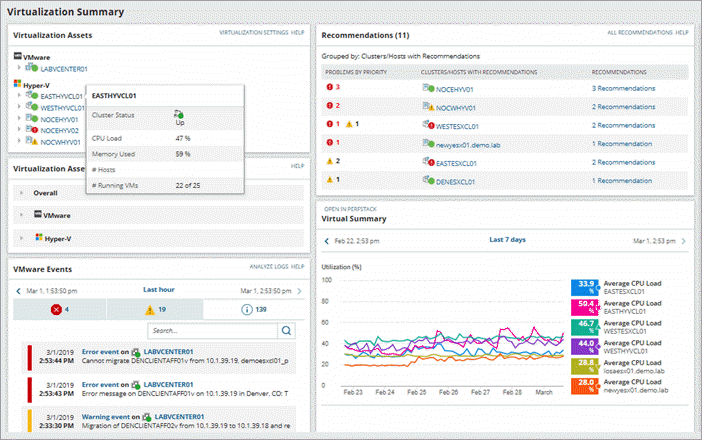

# Virtual Machine

##  What is a hypervisor?

A hypervisor is a program for creating and running virtual machines. Hypervisors have traditionally been split into two classes: type one, or "bare metal" hypervisors that run guest virtual machines directly on a system's hardware, essentially behaving as an operating system. Type two, or "hosted" hypervisors behave more like traditional applications that can be started and stopped like a normal program. In modern systems, this split is less prevalent, particularly with systems like KVM. KVM, short for kernel-based virtual machine, is a part of the Linux kernel that can run virtual machines directly, although you can still use a system running KVM virtual machines as a normal computer itself.

## What is a virtual machine?

A virtual machine is the emulated equivalent of a computer system that runs on top of another system. Virtual machines may have access to any number of resources: computing power, through hardware-assisted but limited access to the host machine's CPU and memory; one or more physical or virtual disk devices for storage; a virtual or real network inferface; as well as any devices such as video cards, USB devices, or other hardware that are shared with the virtual machine. If the virtual machine is stored on a virtual disk, this is often referred to as a disk image. A disk image may contain the files for a virtual machine to boot, or, it can contain any other specific storage needs.

### Advantages of virtual machines

Virtual machines are easy to manage and maintain, and they offer several advantages over physical machines:   

VMs can run multiple operating system environments on a single physical computer, saving physical space, time and management costs. 
Virtual machines support legacy applications, reducing the cost of migrating to a new operating system. For example, a Linux virtual machine running a distribution of Linux as the guest operating system can exist on a host server that is running a non-Linux operating system, such as Windows. 
VMs can also provide integrated disaster recovery and application provisioning options. 

### Disadvantages of virtual machines

While virtual machines have several advantages over physical machines, there are also some potential disadvantages: 

Running multiple virtual machines on one physical machine can result in unstable performance if infrastructure requirements are not met. 
Virtual machines are less efficient and run slower than a full physical computer. Most enterprises use a combination of physical and virtual infrastructure to balance the corresponding advantages and disadvantages. 

## The two types of virtual machines

Users can choose from two different types of virtual machines—process VMs and system VMs:  

A process virtual machine allows a single process to run as an application on a host machine, providing a platform-independent programming environment by masking the information of the underlying hardware or operating system. An example of a process VM is the Java Virtual Machine, which enables any operating system to run Java applications as if they were native to that system.   

A system virtual machine is fully virtualized to substitute for a physical machine. A system platform supports the sharing of a host computer’s physical resources between multiple virtual machines, each running its own copy of the operating system. This virtualization process relies on a hypervisor, which can run on bare hardware, such as VMware ESXi, or on top of an operating system.  

## Top 10 Virtualization Software

Enlisted below are the top 10 Virtualization Software that is available in the market.

### 1) SolarWinds Virtualization Manager 

SolarWinds Virtualization Manager is the platform for monitoring virtual machines. It will help you with fixing and optimizing performance issues. It will perform comprehensive virtual machine monitoring, performance management, capacity planning, and optimization.

- Features:

1. It can provide the complete visibility of VMware and Hyper-V no matter it is on-premises, hybrid or in the cloud.

2. You will be able to alert and monitor on Azure and AWS infrastructure through the same dashboard that is for on-premises or hybrid virtual environment.

3.  You will be able to execute a variety of VM Monitoring and management actions without making use of separate tools.

4.  To optimize the resources, the tool will allow you to trigger such actions manually, using customized alerts, or scripts.

- Pros:

SolarWinds Virtualization Manager can manage across on-premise, hybrid, or in the cloud.
To help you improve the performance, there will be automatic identification of opportunities to free up processing and storage resources.

- Tool Cost/Plan Details: The price of the SolarWinds virtualization manager starts at $2995. It offers a free trial for 30 days. You can select the license based on your requirements for the number of sockets. The pricing is available in the range of $2995 (8 sockets) to $110395 (640 sockets).

### 2) Parallels Desktop

Parallels Desktop was launched in 1999. Its headquarters is in Renton, Washington. They also have offices in Europe, North America, Australia, and Asia. Parallels provide 4 products especially for business and three products for your personal use. This software is for Mac users, to use Windows OS on Mac.

- Tool Features

1. Support for Windows 10 and Mac OS High Sierra.

2. It provides additional tools that will help you in accomplishing your daily tasks.

3. No need to reboot.

4. You will be able to access Excel, PowerPoint, start menu, etc.

5. It has improved its display for Windows OS.

6. It provides a new view mode so that it will be easier for you to view the virtual machine.

- Pros

Additional tools are available for both OS Windows and Mac.
You will be able to access Windows files faster than before and for this, it has improved its performance.

- Cons: Though they provide more than 30 additional tools, not even a single functionality is unique.

Tool Cost/Plan Details: There are three plans i.e. Standard Edition, Pro Edition, and Business Edition. Standard and Pro editions can be upgraded. You will have to contact them for the pricing details of these plans. It also provides a free trial for 14 days

### 3) V2 Cloud

V2 Cloud is a fully-integrated desktop virtualization provider. It enables you to create and manage Windows cloud desktop in 20 minutes. Their VM’s are really fast, and the software is easy to use. V2 Cloud doesn’t require any IT skills, offer fanatical technical support, and has a pay-as-you-go pricing.

- Features:

1. Windows 10 multi-user
2. Blazing fast processors and drives.
3. Fanatical technical support
4. Office365 & AzureAD Integration
5. 50 GB disk space (expandable)
6. Simplified user collaboration
7. Daily backup snapshots
8. Unlimited teleportations globally (America, Europe, Asia, Australia).

- Pros:

Ease of use, admin & setup.
Quality of support
Superfast cloud desktops.

- Tool Cost/Plan Details: V2 Cloud has multiple plans based on the computing resources needed. It goes from The Founder to The Enterprise.

The customers choose a plan that fits their needs (RAM, CPU & Storage) and pays $10 per user, per month with this plan. They provide a risk-free trial of 7-Day.

### 4) VMware Fusion

This software is for Mac users. With the help of VMware Fusion, you can use Windows, Linux, NetWare, Solaris and many other OS on your Mac. Its first version was released in August 2007 and the Latest version 10.1.0 was released in December 2017.

VMware is a subordinate company of Dell Technologies. It is known for cloud computing and virtualization software.

- Tool Features

1. It provides solutions for IT professionals, developers, and businesses.
2. You can use multiple applications on different OS at the same time. There will be no need to reboot.
3. Fusion Pro provides the facility of integration with many development tools.
4. VMware Fusion can be connected with VMware vSphere. vSphere provides a cloud-based platform for virtualization.
5. It can be integrated with third-party software for data center topologies. This feature is available with Fusion Pro.

- Pros

Simple and easy to use.
It provides support for a real-time demonstration of software or application with rollback points.

- Cons: Its drag and drop functionality needs improvement.

- Tool Cost/Plan Details: The cost for version 10 license is $79.99. If you are upgrading from the older version to version 10 then it will cost you $49.99.

### 5) Oracle VM Virtual Box

It was developed by Oracle now. Its first version was released in January 2007 and was developed by Innotek GmbH. Later, it was taken over by Sun Microsystems and now by Oracle. Headquarters of Oracle is in Redwood City, California.

- Tool Features

1. This system is for Windows, Mac, Linux, and Solaris. You can run multiple OS on this system.
2. You can resize the window.
3. It supports drag & drop functionality.
4. It gives you the flexibility to run any application on your PC.

- Pros
It supports four operating systems as a host.
Ease of use.

- Cons
UI needs improvement.
Even though it is free, you have to buy some features for commercial use.

Tool Cost/Plan Details: Free

### 6) VMware Workstation

With the help of this system, you can run multiple OS. This system is for Linux or Windows OS users. This system is specially developed for IT professionals and developers. It will help developers to develop the software to be compatible for multiple OS/platform.

- Tool Features

1. It supports multiple OS that can be run on Linux or Windows PC.
2. This system can work with the cloud. This feature is ‘vSphere Connectivity’. VMware vSphere is a cloud-based platform for virtualization.
3. It will allow you to keep different privacy settings and network configurations for another PC that is virtual.
4. Transferring data to and from the virtual machine to your PC is easier.
5. ‘Helpful Snapshot’ feature helps in software testing.

- Pros: Can be integrated with third-party applications.

- Cons: Can be used only on Linux or Windows PC.

### 7) QEMU

QEMU has released its latest version 3.0.0 on 14th August 18. QEMU is the short form of Quick Emulator. This system is written in C language. It is an open source system.

- Tool Features

1. It supports multiple OS to be run on any system/OS.
2. Hardware virtualization.

- Pros: It can be used on any system. No restrictions for the host OS.

- Cons: Not user-friendly.

- Tool Cost/Plan Details: Free

### 8) Windows Virtual PC

Windows Virtual PC is the virtualization software by Microsoft Corporation. It was first released in September 2009. This system will allow you to run multiple Windows OS simultaneously to accomplish your work from your Windows 7 PC.

- Tool Features

1. You can run multiple OS simultaneously.
2. Host OS should be Windows 7.
3. You can use the print option from the guest OS.
4. You can run multiple virtual machines simultaneously.

- Pros: It is Free.

- Cons: It is only for the Windows operating system. No other OS is supported.

- Tool Cost/Plan Details: Free

### 9) Microsoft Hyper-V

Microsoft Hyper-V is included with Windows Server 2008 and later. To install it on your PC you will just have to follow some steps. It is not available for Home versions of Windows.

- Tool Features

1. Hardware virtualization.
2. It can run multiple virtual machines.
3. These virtual machines can be used with Azure. Thus, we can say that Microsoft Hyper-V supports a cloud-based platform.

- Pros

Supports many versions of Linux.
It comes with Windows Server 2008, Windows 8 and above. Hence, no need to download separately.

- Cons: Applications that require some hardware specifications cannot be run using virtual machines as it can run on host OS only.

- Tool Cost/Plan Details: Free

### 10) RedHat Virtualization

This system was developed by Red Hat Software. It is written in Java. Its first version was released in June 2010. Red Hat is a software company that develops open-source software. Headquarters of Red Hat is in Raleigh, North Carolina.

- Tool Features

1. Applications run fast in virtualization as well. Hence in the top features, they promise improved performance.
2. It is an open-source system. So you can make it, to integrate with the systems as per your requirement.
3. It is easy to use, setup and manage.

- Pros

Ease of use.
It supports Windows OS.

- Cons: Paid support available.

- Tool Cost/Plan Details: Free. However, the Paid version can be purchased through Redhat or their partners.
