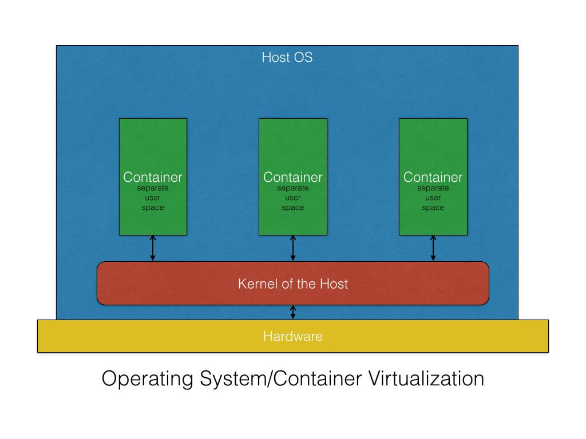
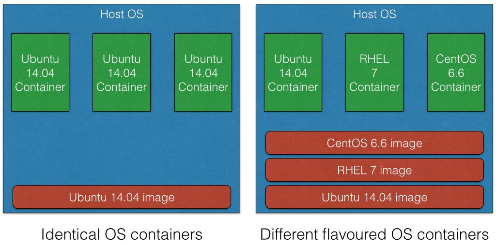
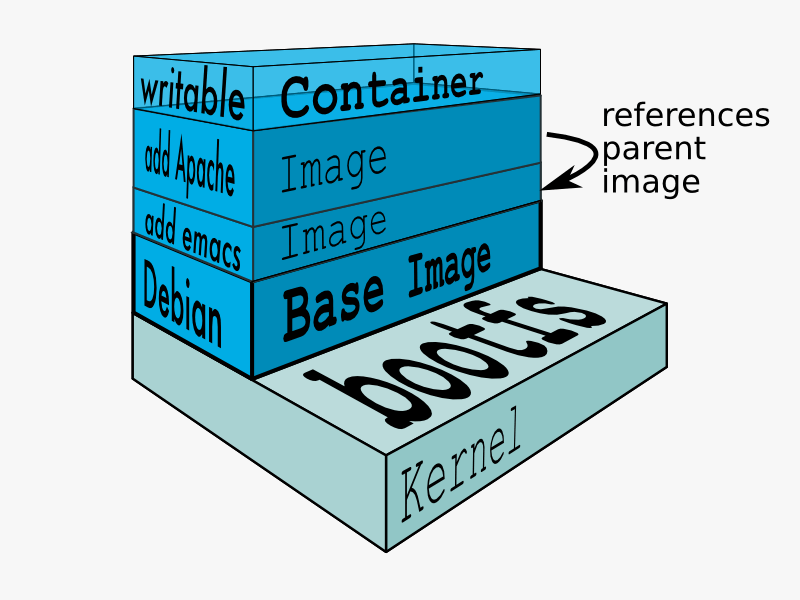
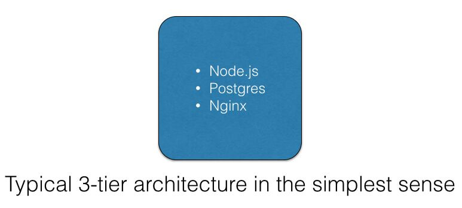
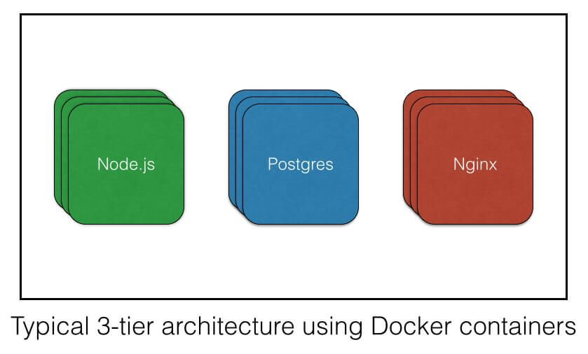
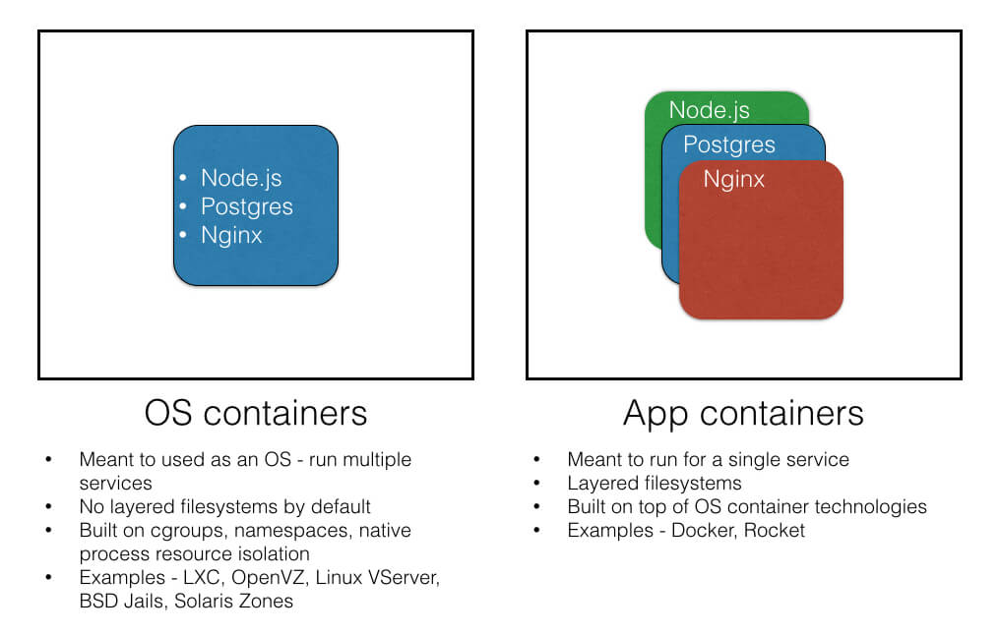

# What's a container?

A container is a standard unit of software that packages up code and all its dependencies so the application runs quickly and reliably from one computing environment to another. A Docker container image is a lightweight, standalone, executable package of software that includes everything needed to run an application: code, runtime, system tools, system libraries and settings.

# Containers exist in two main form (application and system), how do they differ?

OS containers are virtual environments that share the kernel of the host operating system but provide user space isolation. For all practical purposes, you can think of OS containers as VMs. You can install, configure and run different applications, libraries, etc., just as you would on any OS. Just as a VM, anything running inside a container can only see resources that have been assigned to that container.

OS containers are useful when you want to run a fleet of identical or different flavors of distros. Most of the times containers are created from templates or images that determine the structure and contents of the container. It thus allows you to create containers that have identical environments with the same package versions and configurations across all containers.

Container technologies like LXC, OpenVZ, Linux VServer, BSD Jails and Solaris zones are all suitable for creating OS containers.

## Application containers

While OS containers are designed to run multiple processes and services, application containers are designed to package and run a single service. Container technologies like Docker and Rocket are examples of application containers. So even though they share the same kernel of the host there are subtle differences make them different, which I would like to talk about using the example of a Docker container:

Run a single service as a container
When a Docker container is launched, it runs a single process. This process is usually the one that runs your application when you create containers per application. This very different from the traditional OS containers where you have multiple services running on the same OS.

- Layers of containers

Any RUN commands you specify in the Dockerfile creates a new layer for the container. In the end when you run your container, Docker combines these layers and runs your containers. Layering helps Docker to reduce duplication and increases the re-use. This is very helpful when you want to create different containers for your components. You can start with a base image that is common for all the components and then just add layers that are specific to your component. Layering also helps when you want to rollback your changes as you can simply switch to the old layers, and there is almost no overhead involved in doing so.

Built on top of other container technologies

Until some time ago, Docker was built on top of LXC. If you look at the Docker FAQ, they mention a number of points which point out the differences between LXC and Docker.

The idea behind application containers is that you create different containers for each of the components in your application. This approach works especially well when you want to deploy a distributed, multi-component system using the microservices architecture. The development team gets the freedom to package their own applications as a single deployable container. The operations teams get the freedom of deploying the container on the operating system of their choice as well as the ability to scale both horizontally and vertically the different applications. The end state is a system that has different applications and services each running as a container that then talk to each other using the APIs and protocols that each of them supports.

In order to explain what it means to run an app container using Docker, let’s take a simple example of a three-tier architecture in web development which has a PostgreSQL data tier, a Node.js application tier and an Nginx as the load balancer tier.

In the simplest cases, using the traditional approach, one would put the database, the Node.js app and Nginx on the same machine.

Deploying this architecture as Docker containers would involve building a container image for each of the tiers. You then deploy these images independently, creating containers of varying sizes and capacity according to your needs.

# Summary

So in general when you want to package and distribute your application as components, application containers serve as a good resort. Whereas, if you just want an operating system in which you can install different libraries, languages, databases, etc., OS containers are better suited.

